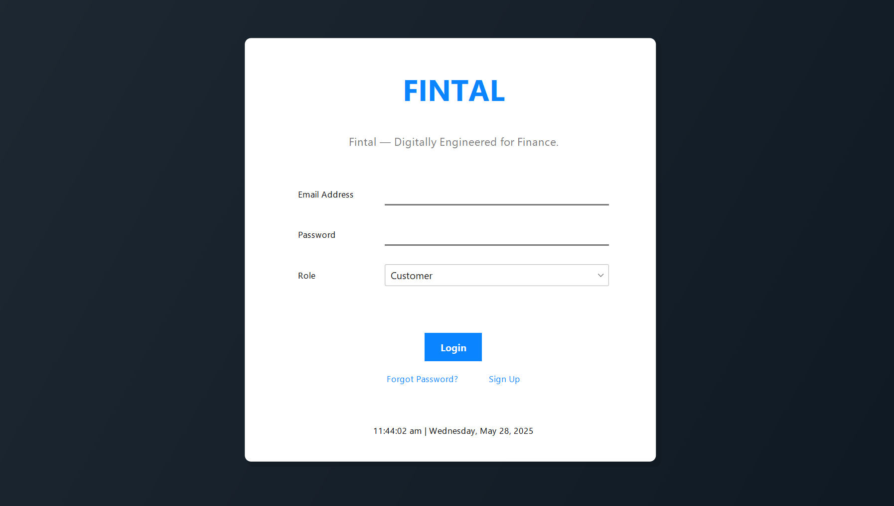
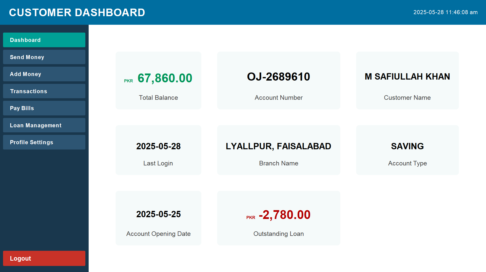
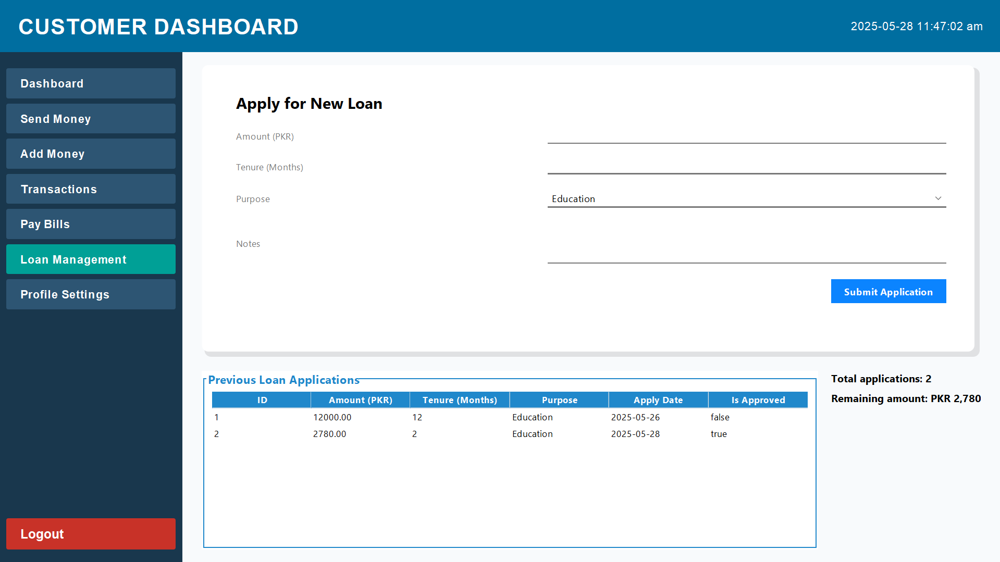
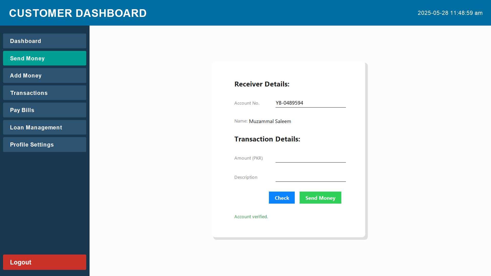
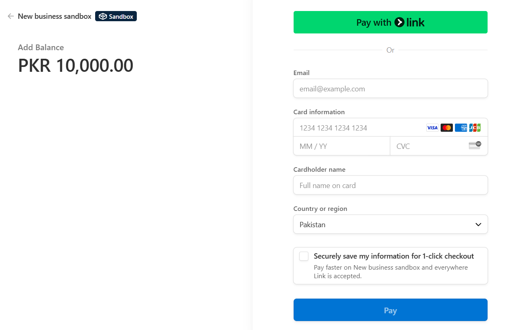
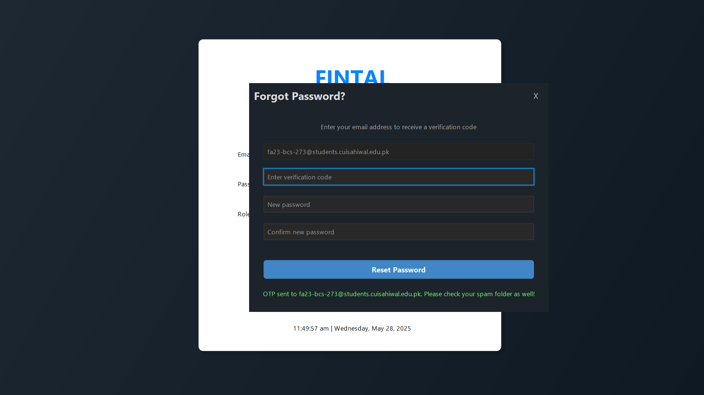

# Fintal: Digitally Engineered for Finance

[](LICENSE)
[](https://www.oracle.com/java/)
[](https://www.mysql.com/)

**Tagline:** *Fintal — Digitally Engineered for Finance*

---

## Overview


**Fintal** represents the next evolution in banking management, seamlessly blending traditional financial systems with modern digital innovation. The name **Finance + Digital** reflects our core mission: delivering comprehensive, efficient banking solutions for the digital age.

Built as a **Java Core backend project**, Fintal serves as both an **academic 4th-semester database project** and an **industry-grade banking solution** with professional-level functionality.

### 🚀 Hashnode Article  
[Developing Fintech Apps using Core Java, Stripe API, and MySQL](https://safi-io.hashnode.dev/developing-fintech-apps-using-core-java-stripe-api-and-mysql)  

### 🚀 Main Features

- **💳 Real Money Transactions** - Stripe integration for actual payment processing
- **👥 Multi-Role Authentication** - Admin, Staff, and Customer dashboards
- **📄 Smart Bill Management** - CSV upload and automated bill processing
- **🔒 Enterprise Security** - BCrypt encryption and secure session management
- **📧 Real-time Notifications** - SendGrid email integration for instant alerts
- **💱 Inter-Account Transfers** - Seamless money transfers between accounts
- **📊 Advanced Analytics** - Comprehensive transaction reporting and insights
- **🎨 Modern UI** - Professional interface with FlatLaf design system

Fintal delivers a **complete banking ecosystem** with secure transaction processing, user management, integrated payment gateways, and real-time notifications - engineered for both learning and professional deployment.

---

## Features

-   **Multi-Role Access & Dedicated Dashboards:**
    -   **Admin:** Comprehensive control over user and staff management, transaction oversight, loan approval processes, and branch monitoring. Presents insightful dashboards for system-wide analytics.
    -   **Staff:** Efficiently manage customer accounts, process bill payments, and provide essential transaction assistance through dedicated interfaces.
    -   **Customer:** Empowered with self-service capabilities to upload and pay bills (via CSV parsing or direct input), conduct secure fund transfers, and gain a clear view of their financial status through personalized dashboards. Beneficiaries can also seamlessly upload bills for processing.

-   **Robust Transaction Management:**
    -   **Inter-Account Transfers:** Facilitates seamless and secure fund transfers between accounts within the system.
    -   **ACID Compliance:** Ensures the integrity and reliability of financial transactions through real-time commit and rollback mechanisms, adhering to Atomicity, Consistency, Isolation, and Durability (ACID) properties.
    -   **Secure Password Handling:** Employs the industry-leading BCrypt algorithm for robust password hashing, safeguarding user credentials.

-   **Integrated Bill Management System:**
    -   **CSV Bill Upload:** Streamlines bill submission through efficient CSV parsing using OpenCSV, allowing users and beneficiaries to upload multiple bills simultaneously.
    -   **Direct Bill Payment:** Enables users to conveniently pay uploaded bills directly through the platform.

-   **Real Money Transactions via Stripe API:**
    -   Seamless integration with the Stripe API facilitates real-world monetary payments and transfers, providing a secure and reliable payment gateway.

-   **Real-time Notifications with SendGrid:**
    -   Integrated with SendGrid to deliver timely email notifications for critical events, including transaction alerts, confirmations, and other important account updates, enhancing user engagement and security.

-   **Beautiful Dashboards:**
    -   Role-based dashboards with insightful charts and reports provide a clear overview of financial data.
    -   Built with FlatLaf for a modern, flat, and aesthetically pleasing UI appearance, enhancing user experience.

-   **Database & Architecture:**
    -   Adheres to a proper **MVC (Model-View-Controller)** architecture with a clean, maintainable, and scalable structure.
    -   Supports essential banking entities: accounts, customers, loans, branches, staff, transactions, bills, and more, ensuring a comprehensive data model.

-   **Security & Reliability:**
    -   Implements robust password hashing using BCrypt and secure data handling practices.
    -   Leverages email notifications for transaction verification and alerts to enhance security and user trust.

---

## Technology Stack

| Layer             | Technology / Library      | Purpose                                    |
| :---------------- | :------------------------ | :----------------------------------------- |
| **Backend** | Java Core                 | Primary programming language and framework |
| **Database** | MySQL with JDBC Connector | Relational database management             |
| **Payment Gateway** | Stripe API                | Processing real-time monetary transactions |
| **Email Service** | SendGrid                  | Sending automated email notifications      |
| **CSV Parsing** | OpenCSV                   | Efficient parsing of CSV files for bills   |
| **JSON Parsing** | Gson                      | Serialization/deserialization of JSON data |
| **Password Hashing** | BCrypt                    | Secure one-way hashing of passwords        |
| **UI Theme** | FlatLaf                   | Modern and flat look-and-feel for the UI   |

---

## Database Tables

The Fintal database, `fintaldb`, is structured with the following key tables to manage all banking operations:

| Table Name           | Description                                    |
| :------------------- | :--------------------------------------------- |
| `account`            | Stores account details and balances.           |
| `admin`              | Admin user information and credentials.        |
| `customer`           | Customer details and profile information.      |
| `triggers`           | Database triggers for automatic processes (e.g., balance updates on transactions). |
| `bill`               | Details of bills uploaded and managed.         |
| `branch`             | Bank branch information and details.           |
| `loan_application`   | Records loan applications and their status.    |
| `staff`              | Staff user information and roles.              |
| `transaction`        | Records of all financial transactions.         |

---

## Installation & Setup

To get Fintal up and running on your local machine, follow these steps:

1.  **Clone the Repository:**
    ```bash
    git clone [https://github.com/safi-io/fintal.git](https://github.com/safi-io/fintal.git)
    cd fintal
    ```

2.  **Configure Database:**
    * Create a MySQL database named `fintal`.
    * Execute any provided SQL scripts to set up tables and triggers. For instance:
        ```sql
        CREATE DATABASE fintal;
        USE fintal;
        -- Run your table creation and trigger scripts here
        -- e.g., SOURCE Helping Files/schema.sql;

        ```

3.  **Set Environment Variables:**
    * Copy `example.config.properties` to `config.properties` in the `resources` directory.
    * Edit `config.properties` and replace the placeholder values with your actual database and API credentials:
        ```properties
        db.url=jdbc:mysql://localhost:3306/fintal
        db.username=your_db_username
        db.password=your_db_password
        stripe.secret.key=your_stripe_secret_key
        sendgrid.secret.key=your_sendgrid_secret_key
        ```

4.  **Build the Project:**
    * Import the project into your preferred Java IDE (Eclipse, IntelliJ IDEA, NetBeans) as a Java project.
    * Ensure all necessary external libraries (listed in the `Technology Stack`) are added to the project's build path.

5.  **Run the Application:**
    * Execute the main application class from your IDE. The backend server will start, following the MVC architecture, and will serve the dashboards and APIs accordingly.

---

## Usage

Fintal provides distinct functionalities tailored for each user role:

* **Admin:**
    * Manage user accounts (customers and staff).
    * View and monitor all system-wide transactions.
    * Approve or reject loan applications.
    * Monitor and manage bank branches.
    * Access comprehensive system reports and analytics.

* **Staff:**
    * Manage customer accounts (creation, updates, inquiries).
    * Assist customers with various transactions.
    * Process and manage bill payments on behalf of customers.

* **Customers:**
    * Securely upload bills for payment (via CSV or manual input).
    * Make payments for uploaded bills.
    * Transfer funds between accounts.
    * View personalized dashboards with transaction history and account summaries.

---


## Screenshots

### Login Screen


### Customer Dashboard


### Loan Management


### Money Transfer


### Payment Checkout (Stripe Gateway)


### Forgot Password (Through Mail)



---

## Contributing

Contributions to Fintal are welcome! If you have suggestions for improvements, new features, or bug fixes, please follow these steps:

1.  Fork the repository.
2.  Create a new feature branch (`git checkout -b feature/YourFeatureName`).
3.  Commit your changes (`git commit -m 'Add new feature'`).
4.  Push to the branch (`git push origin feature/YourFeatureName`).
5.  Submit a pull request.

---

## License

This project is intended solely for **educational purposes** and is not licensed for commercial use.

---

## Contact

For any queries, issues, or feedback regarding Fintal, please feel free to reach out:

* **GitHub Issues:** [https://github.com/safi-io/fintal/issues](https://github.com/safi-io/fintal/issues)
* **Email:** [m.safi.ullah@outlook.com](mailto:m.safi.ullah@outlook.com)

---

Thank you for exploring Fintal — Digitally Engineered for Finance!
